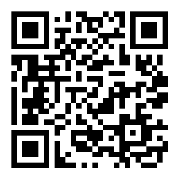
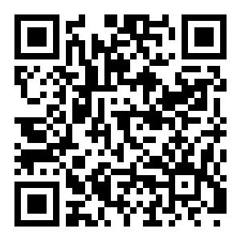
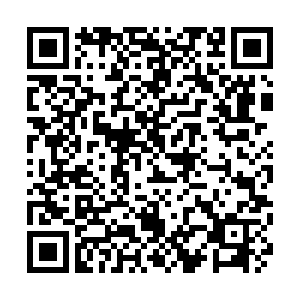

# Transport

Below are detailed techniques for sharing private key data between 2 devices over a local network.

- [Self-signed TLS Certificate Authorised with QR Code](#self-signed-tls-certificate-authorised-with-qr-code)
- [SRP Over TCP](#srp-over-tcp)

## Self-signed TLS Certificate Authorised with QR Code

### Tech implementation

- TLS using a x509 certificate signed with an ephemeral elliptic curve key
- EC public key authorised via QR code scan
- Payload encrypted with a 32 byte / 256 bit AES key that is secretly shared via a QR code.
  - For desktop to desktop scenarios we can display a BIP39 phrase derived from the underlying AES key

### User flow

**Terms**:
- Sender = The device sending private key data
- Receiver = The device receiving private key data

**Flow**:
- **User** puts Sender and Receiver into "onboard from another device" mode
- Sender and Receiver look for each other
- Sender and Receiver show other discovered devices to the User
- **User** selects device to connect to
- Sender or Receiver shows QR code*
- **User** scans QR code on the reading device
- Sender begins data transfer to Receiver
- Receiver confirms to User that transfer is complete

> *Depending on the context either devices may be required to provide the QR Code.
>
> **Example :** The Sender is a mobile device and the Receiver is a desktop computer. In this case it would be unlikely that the desktop computer could scan a QR code, but the mobile device would be able to scan a QR code displayed by the desktop device.
> 
> For further details on QR code presentation please see [QR Codes document](./QRCODES.md).

### Output QR Code

AES Key

AES Key and UUID

AES Key, UUID and Serialised Elliptic Curve Public Key

### Full Technical Flow

- **User** puts Sender and Receiver into "onboard from another device" mode
- Sender generates ephemeral EC key and signs a x509 certificate
- Sender opens a TCP port to make the certificate public
- Sender and Receiver look for each other on the local network, using UDP beacon discovery
  - Devices exchange identity data:
    - Device Name
    - Device UUID
    - Device Type (Mobile, Desktop)
    - Device IP address
- Receiver will access and store the Sender's x509 certificate
- Sender and Receiver show other discovered devices to the User
- **User** selects device to connect to
- Devices negotiate who produces the QR code:
  - If one of the devices is a desktop device the desktop device will produce the QR code
  - If both of the devices are desktop devices a code is generated to share between devices.
    - **TODO** More work needs to be done on this.
  - If both of the devices are mobile devices the Sender will generate the QR code
- QR device shows QR code containing (see [QR Codes document](./QRCODES.md)):
  - a 256-bit AES key
  - a device UUID
  - the serialised ec public key used to sign the TLS certificate
- **User** scans QR code on the reading device
- The reading device verifies the data
  - If the reading device is a Sender, the Sender checks that the:
    - Device UUID matches the exchanged Device UUID from the Receiver
    - The EC public key matches the key the Sender signed the x509 certificate with
    - The AES key is 256-bit
  - If the reading device is a Receiver, the Receiver checks that the:
    - Device UUID matches the exchanged Device UUID from the Sender
    - The EC public key matches the key the Sender signed the x509 certificate with
    - The AES key is 256-bit
  - If any of the checks fail, return error and terminate the connection
- The reading device signals, if required, to initiate transfer.
- Receiver adds supplied x509 cert to list of root certs
- Receiver establishes TLS connection with Sender
- Sender encrypts private key payload with secret AES key
- Sender begins data transfer of encrypted payload to Receiver
- Receiver decrypts private key payload with secret AES key
- Receiver validates decrypted payload with checksum
- Receiver confirms to User that transfer is complete

## SRP over TCP

### User flow

**Terms**:
- Sender = The device sending private key data
- Receiver = The device receiving private key data

**Flow**:
1) **User** puts Sender and Receiver into "onboard from another device" mode
2) Sender and Receiver look for each other
3) Sender and Receiver show other discovered devices to the User
4) **User** selects device to connect to
10) Receiver shows QR code
11) **User** scans QR code on Sender
12) Sender begins data transfer to Receiver
13) Receiver confirms to User that transfer is complete

### Output QR Code

