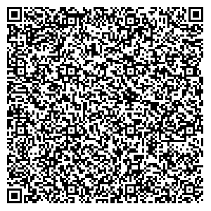

# Transport

- [Extender Self-signed TLS Certificate](#extender-self-signed-tls-certificate)
- [SRP Over TCP](#srp-over-tcp)

## Extended Self-signed TLS Certificate

### Tech implementation

- TLS with an ephemeral key, use extension fields to define 2 extra params, chatKey and chatKeySig.
    - Doing this would overcome the CA issue, because we already have a known public key that we trust and that can produce signatures.
    - Unfortunately we can't just use the chat key to sign the x509 cert because go's x509 library doesn't support secp256k1 curves even though it does support ECDSA private keys.
- Implement an additional precheck on the x509 cert that the public chat key matches the known public key, that the signature verifies. We'd need to show something to the user, to ask for their confirmation, I'm imagining a screen that displays the key and derived data (3 word pseudonym and identicon), show this screen on both devices and ask the user to check that both match.
- Generate a 32 byte / 256 bit AES key that is shared to the client/receiving device via a QR code.
    - For desktop to desktop scenarios we can display a BIP39 phrase derived from the underlying AES key
- Client sends an encrypted message to the server to prove the client has the AES key.
- Server verifies the payload, on success commences sending of private key data encrypted with the AES key

### User flow

**Terms**:
- Sender = The device sending private key data
- Receiver = The device receiving private key data

**Flow**:
1) **User** puts Sender and Receiver into "onboard from another device" mode
2) Sender and Receiver look for each other
3) Sender and Receiver show other discovered devices to the User
4) **User** selects device to connect to
5) Sender shows User a screen of its public key, 3 word pseudonym and identicon
6) Receiver reads the extended x509 cert (like an SSL cert), validates signatures etc
7) Receiver shows User a screen of the Sender's public key, 3 word pseudonym and identicon
8) **User** confirms on Receiver that the Sender's screen and Receiver's screen match
9) Receiver sends message to Sender, confirming that the connection is approved by the user
10) Sender shows QR code
11) **User** scans QR code on Receiver
12) Sender begins data transfer to Receiver
13) Receiver confirms to User that transfer is complete

### Output QR Code

AES Key

AES Key and UUID

## SRP over TCP

### User flow

**Terms**:
- Sender = The device sending private key data
- Receiver = The device receiving private key data

**Flow**:
1) **User** puts Sender and Receiver into "onboard from another device" mode
2) Sender and Receiver look for each other
3) Sender and Receiver show other discovered devices to the User
4) **User** selects device to connect to
10) Receiver shows QR code
11) **User** scans QR code on Sender
12) Sender begins data transfer to Receiver
13) Receiver confirms to User that transfer is complete

### Output QR Code

